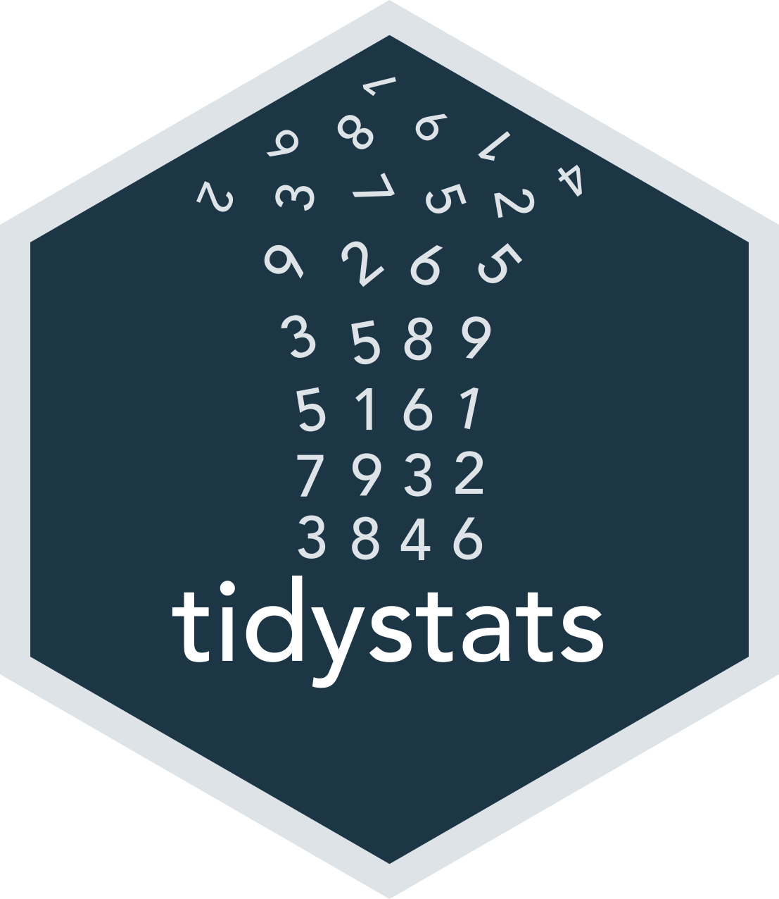

<!-- README.md is generated from README.Rmd. Please edit that file -->



## tidystats

<!-- badges: start -->
[](https://cran.r-project.org/package=tidystats)
<!-- badges: end -->

**Author:** [Willem Sleegers](https://www.willemsleegers.com/)
**License:** [MIT](https://opensource.org/licenses/MIT)

`tidystats` is an R package aimed at sharing the output of statistical models. 
To achieve this, `tidystats` combines the output of multiple statistical models 
and saves these in a file. This file can then be shared with others or used to 
report the statistics in a manuscript.

Please see below for instructions on how to install and use this package. 
**Do note that the package is currently in development. This means the 
package may contain bugs and is subject to significant changes.** If you find 
any bugs or if you have any feedback, please let me know by creating an issue 
here on Github (it's really easy to do!).

### Installation

`tidystats` can be installed from CRAN and the latest version can be installed 
from Github using [devtools](https://github.com/hadley/devtools). 

```{r, eval = FALSE}
library(devtools)
install_github("willemsleegers/tidystats")
```

### Setup

Load the package and start by creating an empty list to store the results of 
statistical models in. You can name the list whatever you want (in the 
example below I create an empty list called `results`).

```{r setup, warning = FALSE, message = FALSE}
library(tidystats)

results <- list()
```

### Usage

The main function is `add_stats()`. The function has 2 necessary arguments:

- `results`: The list you want to add the statistical output to.
- `output`: The output of a statistical test you want to add to the list (e.g., 
the output of `t.test()` or `lm()`)

Optionally you can also specify an `identifier` and add the `type` of analysis, 
whether the analysis was `preregistered`, and/or additional `notes`.  

The `identifier` is used to identify the model 
(e.g., 'weight_height_correlation'). If you do not provide one, one is 
automatically created for you.

The `type` argument specifies the type of analysis as primary, secondary, or 
exploratory.

The `preregistered` argument is used to indicate whether the analysis was
preregistered or not.

Finally the `notes` argument is used to add additional information which you may
find fruitful.

### Supported statistical functions

**Package:** stats

- `t.test()`
- `cor.test()`
- `chisq.test()`
- `wilcox.test()`
- `fisher.test()`
- `oneway.test()`
- `aov()`
- `lm()`
- `anova()`

### Example


```{r example-setup, echo = FALSE, message = FALSE}
library(dplyr)
```

In the following example we perform several tests, add them to a list, and save
the list to a file.

```{r, eval = FALSE}
# Conduct three different analyses
# t-test:
sleep_test <- t.test(extra ~ group, data = sleep, paired = TRUE)

# lm:
ctl <- c(4.17,5.58,5.18,6.11,4.50,4.61,5.17,4.53,5.33,5.14)
trt <- c(4.81,4.17,4.41,3.59,5.87,3.83,6.03,4.89,4.32,4.69)
group <- gl(2, 10, 20, labels = c("Ctl","Trt"))
weight <- c(ctl, trt)
lm_D9 <- lm(weight ~ group)

# ANOVA:
npk_aov <- aov(yield ~ block + N*P*K, npk)

# Add the analyses to an empty list
results <- results %>%
  add_stats(sleep_test, type = "primary") %>%
  add_stats(lm_D9, preregistered = FALSE) %>%
  add_stats(npk_aov, notes = "An ANOVA example")

# Save the results to a file
write_stats(results, "results.json")
```

This results in a .json file that contains all the statistics from the three 
models. If you want to see what this file looks like, you can inspect it [here](https://github.com/WillemSleegers/tidystats/blob/master/inst/results.json).

## Reporting statistics

If you want to report the statistics in a manuscript, you can soon do so with a
Word add-in that is currently in development.

## More resources

For more information on this package, see the `tidystats` project page on [my 
website](https://www.willemsleegers.com/tidystats.html).