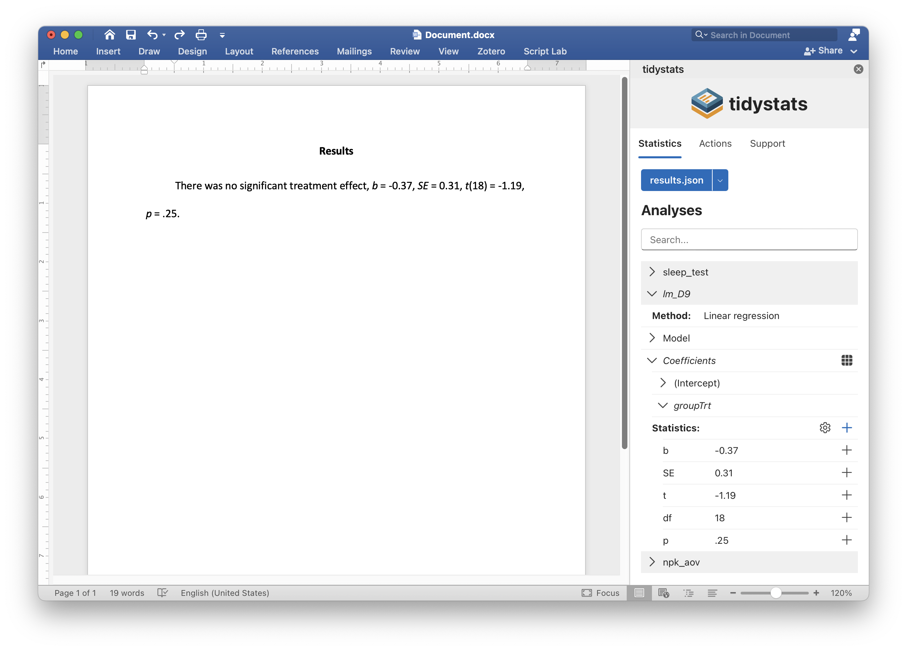

The tidystats Word add-in can be used to report statistics in a Microsoft Word
document, using a file created with the tidystats R package.

## Main features

- A user-friendly point-and-click interface to insert statistics in APA style
- Insert multiple statistics with a single click
- Customize which statistics to include when inserting multiple statistics
- Update reported statistics with new statistics in one go

## Installation

The tidystats Word add-in is available in the Office Add-in store. You can find
this store in your Word document by going to the Add-in section of the Insert
tab. Simply search for 'tidystats' and you should find the add-in.

Once installed, a button saying 'Insert Statistics' will be added to the Insert
tab of your Word document.

## Usage

Open the tidystats add-in by clicking on the 'Insert Statistics' button found in
the Insert tab of your Word document. After tidystats opens, click on 'Upload
statistics' to select the file created with the tidystats R package. This will
reveal a list of analyses. Click on the dropdown arrows to reveal the statistics
of each analysis.

Click on the plus icon next to an individual statistic to insert that statistic,
or click on the plus icon next to 'Statistics:' to insert multiple statistics
into your document at the location of your cursor.

It is possible to customize exactly which statistics will be reported when
inserting multiple statistics. Click on the gear icon next to 'Statistics:' to
reveal checkboxes next to each statistic. By default, all checkboxes are
checked. Unchecking a checkbox will prevent that statistic from being inserted
when inserting multiple statistics at once.

To update reported statistics, click on the 'Update statistics' button in the
Actions tab after uploading a new file with corrected statistics. This will
automatically update all reported statistics that share the same identifier.

## An example

Below is an example of how to use several features of the tidystats add-in.

<video controls style="width:100%; border-radius: 8px;">
  <source src="example.mp4" type="video/mp4">
</video>

## Privacy

For information on data collection and privacy, see the
[privacy statement](privacy-statement.html).

## Support

Do you have a question or comment, or would you like to request a feature?
Create a [GitHub issue](https://github.com/WillemSleegers/tidystats/issues) or
send an [e-mail](mailto:tidystats@gmail.com).
